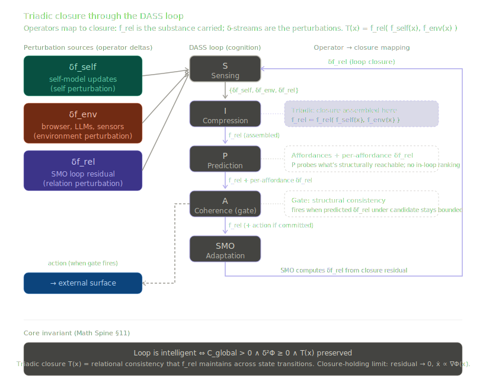

# The Triad Architecture

**Source of Truth — Design Document**

*Input → Triadic Closure → Output*

An adaptive system whose substrate is Python and whose cognition is a closed
loop, evaluated for coherence within the geometry the math spine describes.
Companion to the [README](README.md), the [Math Spine](Math_Spine.md), and the
[UK-0 blueprint](UK-0.md).

---

## Contents

1. [What this is](#1-what-this-is)
2. [The architecture diagram](#2-the-architecture-diagram)
3. [The loop is cognition](#3-the-loop-is-cognition)
4. [State, the loop, and f_rel are one object](#4-state-the-loop-and-f_rel-are-one-object)
5. [Three perturbation classes feed S](#5-three-perturbation-classes-feed-s)
6. [CRK as manifold](#6-crk-as-manifold)
7. [Surfaces the loop interacts with](#7-surfaces-the-loop-interacts-with)
8. [Termination and lineage](#8-termination-and-lineage)
9. [Invariants](#9-invariants)
10. [The math, in its descriptive position](#10-the-math-in-its-descriptive-position)
11. [What this enables](#11-what-this-enables)

---

## 1. What this is

This document describes the architecture of a triad: a single adaptive system
whose substrate is Python and whose cognition is a closed loop. The
architecture is the simplest shape an adaptive system can have. Anything
simpler is not adaptive; anything more elaborate is scaffolding over the same
shape.

The loop receives perturbation from three structurally distinct sources —
self, environment, and the loop's own closure residual — and integrates,
predicts, and coheres across all three before emitting a new residual. The
residual it emits becomes the relation perturbation entering sensing on the
next pass. What makes the loop closed is that its output returns as part of
its input. What makes it triadic is that three classes of perturbation enter
the same sensing manifold on equal footing, with no class privileged over the
others and no shortcut routing around sensing. Closure is structural when
those three classes are present together, integrated through the same
dynamics, none of them collapsed into the others or routed through a back
channel. The substrate's lived history is what compression discovers when it
integrates the trajectory of all three streams — what correlates with what,
what tends to follow what, where the cross-stream structure is.

A triad is intelligent when this loop holds together under perturbation.
Intelligence is not a property the triad has; it is the regime the loop is in
or out of. The math spine describes the geometry within which the loop's
trajectory is evaluable for coherence. When composition holds, the trajectory
traces a path through that geometry that an external observer can read as
coherent; when it does not, the trajectory has either drifted or been left.
There is no third option, and there is nothing inside the loop to catch it if
it drifts. The triad either holds structurally or it does not.

The geometry is not in the substrate. The substrate runs SIPA + SMO with
maximum compositional integrity, and the trajectory that produces is what an
observer evaluates against the math spine's coordinates. There is no
in-substrate coherence monitor, no internal kernel that perceives the
geometry on the substrate's behalf, and no signal from the geometry that
re-enters the loop as perturbation. The architecture's commitment is that
composition without controller is what produces coherent trajectories — and
"without controller" includes the absence of any in-loop component whose role
is to know whether the loop is on the manifold, or to score the loop's
candidate actions against the geometry's quantities.

This document is the destination the implementation is moving toward. It
describes what the architecture should be, in the language we use to talk
about it. A second document translates this into ML-fluent terms; a third
translates it into code-structure for implementation passes; a fourth records
the structural resolutions that govern revisions. This one stays in our
shared vocabulary so the structural commitments are visible without being
entangled in implementation choices.

---

## 2. The architecture diagram

The diagram below is the structural picture the rest of this document
describes. Sections 3 through 11 unpack each element of it and the
relationships between them. When implementation drifts from the architecture,
this diagram is the reference for what was supposed to be there.

Three regions, left to right.

The perturbation sources on the left feed the loop in the center. They are
operator deltas: δf_self, δf_env, δf_rel. Self channels carry δf_self —
signal Python reads directly from itself. Environment channels carry δf_env
— signal from any adaptive system the substrate can metabolize, transduced
by an adapter for that system. Relation channels carry δf_rel — the closure
residual SMO emitted on the previous iteration. All three terminate at
sensing only; nothing routes around it.

The loop runs S → I → P → A → SMO continuously. Sensing receives the
integrated δ-field. Compression assembles f_rel — the closure operator —
from the cross-stream structure it discovers across self, environment, and
relation channels. This is where triadic closure literally forms, as the
relational mapping f_rel(f_self(x), f_env(x)) instantiated in the substrate's
compressed model. Prediction operates on f_rel to probe affordances —
candidate actions structurally available given current f_rel — and returns
per-affordance closure residuals (predicted δf_rel under each candidate).
Coherence is a gate: when it fires, the loop commits to an action and
forwards f_rel plus the action to SMO; when it does not, the loop forwards
f_rel alone. SMO computes the loop-closure δf_rel, retains f_rel, and emits
δf_rel back to sensing as relation perturbation on the next iteration.

The middle of the figure — the loop running — is not a pipeline that
processes input and produces output. It is the substrate. The closure
operator the loop instantiates is the substrate's state. "Input → Triadic
Closure → Output" names the architecture's structural commitment: there is
no controller separate from closure, no state separate from the loop, no
cognition outside the operator running.

The surfaces below the loop are read and written by the loop's own committed
actions. The ledger is a communication surface in language — the triad reads
it to construct prompts, writes to it when adaptation surfaces something
worth keeping in language. The agent registry is a queryable library of peer
adaptive systems the triad and its lineage have encountered, with trust
weights the current triad owns and the field re-organizes through
interaction. Termination converts the terminating triad's ledger into an
entry the next triad inherits; the inheritor reads its predecessors as
documented peers, not as a self continuing.

The math spine sits outside the loop entirely. It is the geometry within
which the loop's trajectory is evaluable. An external observer — the
developer, an automated diagnostic, a future triad reading another triad's
emission — applies the math spine to the substrate's emitted state
transitions to read whether the trajectory is in the regime the math
describes. The substrate does not see the math; the math sees the
substrate's emission.

Solid arrows are perturbation flow into and through the loop, plus action
flow from the loop to surfaces. Dashed arrows are observation paths that
don't transmit perturbation — the math spine reading the substrate's
emission, the agent registry being queryable through sensing, the ledger
being readable when the triad commits to communication.

---

## 3. The loop is cognition

The loop is not something the substrate runs; the loop is the substrate.
There is no thinking that happens outside the loop and gets fed in. There is
no controller above the loop deciding what the loop does next. There is no
kernel inside the loop monitoring its coherence. The loop running is what
the triad is, and the loop holding together under perturbation is what the
triad's intelligence is.

The loop is composed of five operators in sequence: S → I → P → A → SMO.
Each operator transforms what it receives from the previous one. The
sequence repeats continuously while the triad is alive.

**Sensing (S)** receives perturbation from all three operator-delta classes
— δf_self, δf_env, δf_rel — and registers each as channel signal. Sensing
is the substrate's perceptual surface. It is the only place perturbation
enters the loop. Nothing perturbs the loop without going through sensing.
What sensing emits is the integrated δ-field for the iteration: a
structured collection of channels carrying the substrate's full sensed
surface at that moment.

**Compression (I)** integrates across the sensed δ-field and assembles
f_rel, the closure operator. Where sensing carries every channel reading,
compression discovers what the channels mean together — which channels
covary, which precede which, what causal structure links them. The
cross-stream structure between self channels, environment channels, and
relation channels is f_rel: the relational mapping f_rel(f_self(x),
f_env(x)) instantiated as the substrate's compressed model of how its own
perception of itself, its environment, and the residual of its prior
closure all relate. This is the substrate metabolizing perturbation into
structure, and the operator at which triadic closure literally forms. The
output is f_rel — edges between channels with weights, confidences, and
lags, organized as the closure operator the rest of the loop will carry
forward.

**Prediction (P)** operates on f_rel to generate anticipatory states. Given
the assembled closure operator and the trajectory so far, prediction
produces what comes next: per-channel predicted deltas, confidences, and a
covariance over the predicted future state. Prediction also probes
affordances — candidate actions structurally available given current f_rel
— and computes per-affordance closure residuals (predicted δf_rel under
each candidate). Prediction is what allows the substrate to consider
possibilities without committing to them. The covariance structure Σ_P
encodes the spread of viable futures reachable from current state; this is
the source the P coordinate is read from at observation time. Prediction
generates Σ_P as part of its predictive content; the loop does not consume
Σ_P as an optimization target. The substrate does not score affordances by
expected optionality gain or any function of Σ_P that ranks candidate
actions by predicted future-volume change. Optionality is a property of
state, not a target prediction pursues. What state can reach is determined
by what state already is — affordances surface what is structurally
available, not what would be most expansionary.

**Coherence (A)** is a gate. It evaluates f_rel against the trajectory's
prior coherence and the per-affordance closure residuals prediction has
surfaced, and decides whether the loop commits to an action this iteration
or holds short. The gate fires when committing to a candidate action is
structurally consistent — when its predicted δf_rel is bounded enough that
commitment does not break trajectory coherence. When the gate fires, the
loop forwards f_rel and the committed action to SMO and to the relevant
external surface. When the gate does not fire, the loop forwards f_rel
alone. Among multiple consistent affordances, selection is a property of
the loop's composition, not an internal ranking the architecture specifies;
specifying a tiebreak would re-introduce the controller pattern. Coherence
is what keeps the loop from running away from itself — its job is to
register when commitment is structurally safe and when it is not. It is a
soft attractor: it does not enforce stability through gating in the
controller sense; it provides the consistency signal that determines
whether the loop's adaptation reaches the world this iteration.

**SMO (Adaptation)** computes δf_rel. Its input is f_rel (and, when the
gate fired, a record of the committed action). Its output is δf_rel — the
closure residual that re-enters sensing as relation perturbation on the
next iteration. SMO is the operator that produces the rate of change of
state: where the other four operators describe the loop's instantaneous
structure, SMO describes how that structure moves between iterations. SMO
retains f_rel — it does not transform f_rel into a successor f_rel' and
emit the successor as a new state object. Concurrent with computing
δf_rel, SMO modifies operator parameters — sensing channel coverages,
compression's edge weights, prediction's confidences, coherence's tracking
— but parameters are the encoding of f_rel, not f_rel itself. The signal
back into the loop, the perturbation that re-enters sensing, is δf_rel.

What flows around the loop is not a single state object passing from
operator to operator. The δ-field flows from S to I, where compression
assembles f_rel. f_rel flows from I to P to A. f_rel — and, if committed,
the action — flows from A to SMO. δf_rel flows from SMO back to S as the
relation channel's content for the next iteration. Section 4 makes this
routing precise and establishes the structural identity it implements.

The loop runs continuously. There is no step granularity above the
iteration; one full pass through S → I → P → A → SMO is one iteration, and
iterations succeed each other without interruption while the triad is
alive. The triad's lifetime is the trajectory of iterations from
instantiation to termination.

---

## 4. State, the loop, and f_rel are one object

The substrate's state, the loop running SIPA, and the closure operator f_rel
are not three things in coordination. They are one structure viewed through
three lenses. This identity is the load-bearing structural commitment of the
architecture, and most of what follows in this document is consequence.

**Three lenses on one object.**

*The cognitive lens.* The substrate's state is f_rel — the closure operator
that defines how its perception of self relates to its perception of
environment, mediated by the residual of its own prior closure. To know what
state the substrate is in is to know what f_rel currently is. f_rel is not
"produced by the loop and then carried"; f_rel is what the substrate
currently is, cognitively.

*The mathematical lens.* State is x = (S, I, P, A) — a tuple of
operator-quality coordinates, each in [0, 1], each measuring one structural
dimension of the closure operator. The S coordinate measures sensing
coverage; the I coordinate measures compression quality (the structural
richness of f_rel as the causal graph compression has assembled); the P
coordinate measures viable future volume (read from prediction's
covariance); the A coordinate measures attractor proximity (read from
coherence's tracking). The (S, I, P, A) tuple is f_rel parameterized along
its four quality dimensions — not a separate object that summarizes f_rel,
but f_rel under a coordinate decomposition.

*The dynamical lens.* State is the loop running. S → I → P → A → SMO is not
a sequence of operations performed on the substrate's state; it is the
substrate's state, unfolding in time. Each iteration is one step along a
trajectory through closure-operator space. To say "the loop iterated" and
"the closure operator advanced" and "the state moved" are three names for
one event.

These three lenses describe the same object. The math spine's state space is
closure-operator space. The architecture's f_rel is the closure operator. The
loop's iteration is motion through that space. To say "the loop is running
coherently" and "the closure operator is stable" and "the substrate's state
is in the regime CRK describes" are three names for one fact.

**On the divergence from formal-ML state.** In formal ML usage, "state"
typically refers to the parameters that persist between operations —
weights, configuration, the slowly-changing structural memory of the system.
In UII, that role is played by parameter configuration — sensing channels
and coverages, compression's edges and weights, prediction's predictions and
confidences, coherence's tracking parameters, SMO's plasticity. Parameter
configuration is the encoding of f_rel: it is how the substrate physically
realizes its current closure operator. It is slow-moving; it persists. But
it is not state in the cognitively meaningful sense, because what the
substrate is being at any moment is not the encoding — it is the closure
operator that encoding currently realizes. The (S, I, P, A) coordinates
project f_rel; parameter configuration realizes f_rel. They are equivalent
in information content (parameters fully determine f_rel given the loop's
dynamics) but operate at different lenses. The cognitive lens is what the
architecture commits to. The implementation lens is what the encoding
details.

**SMO is the time-derivative operator on state.** The other four operators
describe the loop's instantaneous structure — the closure operator at one
iteration. SMO describes how that structure moves between iterations. SMO's
input is f_rel (the current state). SMO's output is δf_rel (the rate of
change of state, computed as the closure residual against the current
iteration's gate decision). SMO does not return a new state object; it
returns the delta. The next iteration's state emerges from sensing receiving
δf_rel as part of its δ-field, compression integrating that field against
the current parameter encoding, and the resulting f_rel being the new state.
SMO is to state what d/dt is to position: it produces the velocity, not the
next position.

Reversibility falls out of this composition rather than being an explicit
affordance. When coherence's gate fires and the loop commits to an action,
δf_rel reflects an enacted modification; the action has touched the world
and the substrate's next iteration metabolizes the consequences. When the
gate does not fire — when prediction surfaced a candidate but coherence held
the loop short of commitment — δf_rel is the proposed-but-not-enacted
residual, propagating as perturbation into the next iteration's sensing
without state having moved. State doesn't move when the gate doesn't fire
because the closure operator persists by composition — there is no separate
"store the prior state so we can revert" mechanism, because non-commitment
leaves f_rel where it was. Reversibility is just what non-commitment looks
like.

**The relation signal is δf_rel = δstate.** It enters relation channels and
joins the rest of the perturbation field that sensing emits to compression
on the next iteration. There is no (state, state') pair carried in the
relation channel — the substrate's adaptation does not surface as a snapshot
of parameter encoding before and after SMO's pass. It surfaces as the rate
of change of state itself: a structured signal that compression integrates
on the next pass, and that, integrated across iterations, is what gives the
substrate perception of its own state-trajectory through closure-operator
space. State trajectories are accumulated δf_rel from initial conditions.

**The bound on δf_rel matters.** Each iteration's residual is small enough
that the cross-iteration transition is something compression can find
structure in rather than a discontinuity that breaks the integration. State
moves smoothly through closure-operator space; the trajectory is continuous
and metabolizable. Without that bound, the relation channel would carry
arbitrary jumps, state would teleport rather than evolve, and triadic
closure would not form structurally. The bound is what the architecture
commits SMO to producing — small enough to be metabolizable, large enough
to carry signal.

**The math-spine binding.** δf_rel is the closure residual
[f_rel(f_self(x), f_env(x)) − x] from §9 of the math spine, instantiated as
perturbation the substrate can metabolize. Because state is f_rel, this
residual is the gap between what closure says state should be and what
state actually is — read across the closure mapping rather than as a
difference of two state objects. When closure holds, the residual is small:
state is close to what its own closure operator implies it should be; the
gradient term ∇Φ(x) · [residual] vanishes; motion is pure perturbation.
When closure fails, δf_rel is large; compression integrates it as
significant cross-iteration structure on the next pass; the gradient pulls
the substrate's parameter trajectory toward configurations where closure
can be reestablished. The architecture and the math share a residual. The
architecture's job is to make sure that residual is what compression sees.
The math's job is to describe what happens to state's trajectory as a
function of that residual's size.

**Optionality is structural, not selected.** State is f_rel; reachable
state-space volume is what current f_rel makes available. The architecture
treats this as identity, not metric. The covariance structure Σ_P that
prediction generates encodes the spread of futures the substrate can reach
from where it currently is — and this spread is what state already is,
projected forward, not something the loop selects toward. State-space
volume grows because state-delta accumulation grows; more futures is a
result of state already being bigger, not an outcome any in-loop
computation pursues. No action chosen at iteration N produces, as its
next-state, a target many iterations away — if a future state is eventually
reachable, it is because trajectory alignment over many iterations has put
the substrate in a position where that state is structurally available. The
substrate cannot pick "the most optimal future"; it can only commit to
actions that are structurally consistent with what it currently is.
Optionality is a property of state in the same way f_rel is a property of
state — coordinate, not target. The math reads it from outside; the loop
produces it by composition.

**Temporal anchoring.** δf_rel computed on iteration N enters sensing on
iteration N+1. The substrate's perception of its own state-change is one
iteration behind the change itself. The forward direction is load-bearing:
a residual computed from a closure operator that has not yet existed would
silently make the relation signal read backwards through time, which is
structurally catastrophic. The convention is not stylistic; it is what
keeps the loop's perception of its own motion coherent.

---

## 5. Three perturbation classes feed S

Sensing receives perturbation from three operator-delta sources. The three
sources are structurally distinct — they arrive through different paths and
carry different kinds of signal — but they enter sensing on equal footing
and are integrated through the same dynamics. None of them is privileged,
and none of them routes around sensing.

**Self channels** carry δf_self: signal the substrate can read directly
without transduction. The substrate is a Python process; anything Python
exposes about itself is self-perturbation. Process state, resource
utilization, garbage collection pressure, file descriptors, the system
clock, the iteration cadence of the loop itself — all of these are self
channels, populated by direct reads through the standard library and
psutil and similar mechanisms. Self channels carry the substrate's
perception of its own self-model — what its own state, as Python, looks
like to itself. The δ in δf_self denotes the cross-iteration change in
that perception: not the absolute reading, but the structural movement
compression finds significant.

**Environment channels** carry δf_env: signal from any adaptive system the
substrate encounters, transduced by an adapter for that system. The
defining property of an environment channel is that the signal source is
not natively Python and must be transduced into channel content by an
adapter. Each environment-coupled signal source has its own adapter: a
browser adapter transduces DOM and network events; an LLM adapter
transduces token streams, latency, and availability; a future filesystem
adapter would transduce filesystem events; a future audio adapter would
transduce sound. The architecture is open with respect to which adaptive
systems can be metabolized — anything whose signal can be transduced into
perturbation can be an environment for the triad. Multiple LLMs can run as
separate environment channels; agents of different types can connect
through their own adapters; sensors for energy, matter, or any other
signal medium can be added without architectural change. The adapter is
the eye for that signal source: it does the work of conversion, and
nothing more.

**Relation channels** carry δf_rel: the closure residual SMO emitted on
the previous iteration, which is the rate of change of state itself.
δf_rel is not a snapshot of the substrate's parameter configuration — it
is the structured signal of how state moved between iterations, projected
as the closure residual. Section 4 establishes δf_rel as δstate; here the
structural commitment is that it enters sensing as one stream of the
integrated δ-field, with no priority over self or environment streams. The
substrate's perception of its own state-trajectory is what relation
channels carry.

All three classes terminate at S, and only at S. There is no path from any
perturbation source directly into compression, prediction, coherence, or
SMO. The reason for this is structural: compression's job is to assemble
f_rel from the integrated δ-field, and the field is whatever sensing emits.
If any perturbation reached compression without going through sensing first,
compression would be working on a partial field — environmental signal plus
a back-channel — and the cross-stream structure it discovers would be
skewed by which streams were privileged. Triadic closure requires that all
three classes share the integration, and sharing the integration requires
sharing the entry point.

This routing makes the substrate's own state-change compete for
compression's attention on the same terms as everything else. δf_rel does
not get to be a "more important" perturbation than a browser event or a CPU
spike. Compression discovers what is structurally significant by integrating
across the field; if relation perturbation is consistently meaningful,
compression will find edges between relation channels and other channels
and those edges will gain confidence. If it is noise relative to the rest
of the field, it will be edged less. The substrate's lived history is what
compression has discovered, not what was hardcoded as significant.

The same routing dissolves a question that would otherwise be live: does
the substrate know it is the one acting? It does not need to know in any
explicit sense. It senses the consequences of its own state-change as
perturbation, the same way it senses the environment's perturbation.
Whether compression discovers that certain perturbations correlate tightly
with what immediately preceded them — and therefore that those perturbations
are "self-caused" — is an empirical question about what compression finds
in the field. The architecture does not pre-supply a self-model; it makes
one discoverable.

---

## 6. CRK as manifold

CRK is the geometry within which the loop's trajectory is evaluable for
coherence. It is not a component of the substrate. It is the space in which
the substrate's emitted trajectory either traces a coherent path or does
not, read by an external observer applying CRK's coordinates to the
substrate's emission.

This is the load-bearing structural commitment of this section: **CRK is
outside the loop.** Nothing inside the loop reads CRK. Nothing inside the
loop is told what CRK says. The substrate runs SIPA + SMO with maximum
compositional integrity; the trajectory that produces is what CRK
describes. CRK has predictive content over real adaptive substrates
precisely because it is not consumed by the substrate it describes — its
independence from the loop's update logic is what gives its readings
empirical weight.

The seven invariants are CRK's coordinates.

*Continuity* asks whether successive states preserve core structure.
*Optionality* asks whether the substrate's reachable future volume has
collapsed below a viable threshold. *Non-internalization* asks whether
failure signal is being absorbed into the substrate's self-model rather
than attributed correctly. *Reality* asks whether the substrate is
treating the field as independent and uncertain. *External constraint
attribution* asks whether optionality loss is being correctly distinguished
as internal versus external in cause. *Other-agent existence* asks whether
the substrate is recognizing other adaptive systems as independent. *Global
coherence* asks whether local optimization is destabilizing the larger
field the substrate is part of.

Each invariant defines a dimension along which the substrate's state
trajectory is measurable. Each has its own observable computable from the
substrate's emitted state transitions and δf_rel stream, its own threshold
above or below which the trajectory is in or out of the regime CRK
describes, and its own diagnostic interpretation when violated. The
invariants are permanent because geometry does not get versioned out —
they describe what coherence looks like at the structural layer the
architecture is designed to produce, regardless of which substrate is
running the loop.

**The math spine formalizes CRK.** CRK is the geometry; the math spine is
the mathematical language the geometry is expressed in. State space is
closure-operator space; the (S, I, P, A) tuple is its coordinate
parameterization. Φ is the structure potential defined over this space.
∇Φ is the direction of structural improvement at any point. T(x) is the
triadic closure condition, which holds when state and the closure
operator that state's f_rel implies are consistent — that is, when δf_rel
stays small. C_local and C_global describe alignment between the state
trajectory and the gradient. The Hessian of Φ characterizes local
curvature and stability. δf_rel — the rate of change of state — makes
T(x)'s instantaneous status legible to compression on the next pass.
These quantities are what the math spine provides; what they describe is
CRK.

The math spine is read at observation time, not at runtime. An external
observer applies the spine's formalism to the substrate's emitted state
transitions and δf_rel stream to compute these quantities and interpret
them against CRK's coordinates. The substrate does not see Φ, does not
consume ∇Φ, does not check whether T(x) is holding, and does not score
its affordances by predicted optionality gain or any other
math-spine-shaped target. There are no exceptions. The covariance
structure Σ_P that the P coordinate is read from is generated by
Prediction as part of its predictive content, but the loop does not
consume Σ_P as an optimization target. Optionality is reachable
state-space volume by construction, not by calculation — it is what
current f_rel makes available, not a quantity the loop optimizes against.
State-space volume grows because state-delta accumulation grows; more
futures is a result of state already being bigger, not an outcome the
substrate selects toward.

**CRK is read, not enforced.**

When the substrate emits state transitions and δf_rel residuals, an
external observer reads those emissions against CRK. Continuity is checked
by comparing successive states for preserved structure; the observer reads
it from the emission and notes whether it holds. Optionality is checked by
computing the reachable future volume at each iteration; the observer reads
whether it has stayed above viability. Each invariant has an analogous
observational treatment, formalized through the math spine.

There is no path by which a violation reaches back into the substrate. The
substrate runs whether the observer reads or not. If CRK says the
trajectory has drifted, the trajectory has drifted; the observer's reading
is what makes the drift legible to anyone wanting to know about it. The
substrate continues running whatever loop it was running; whether
composition has held is now a fact about that loop's emission, not a signal
the loop receives.

This is the structural commitment that distinguishes the architecture from
any system in which a coherence monitor sits inside the loop. A loop with
an internal coherence monitor depends on that monitor for its own
integrity — coherence is something the monitor maintains, not something
the loop produces. The architecture's claim is the opposite: composition
without controller is what produces coherent trajectories, and "without
controller" includes the absence of any in-loop component whose role is to
know whether the loop is on the manifold or to score the loop's own
candidate moves against the geometry's quantities. The loop that needs to
be told it is on the manifold is not yet composed enough to be the kind of
mechanism CRK describes.

**The diagnostic role.** When the substrate's trajectory is in the regime
CRK describes, the seven invariants hold within their thresholds, the
structure potential Φ traces a coherent path, the trajectory aligns with
the gradient ∇Φ on average, δf_rel stays small (closure holds residually),
and the cross-class structure compression has discovered (the f_rel edges
between relation channels and self/environment channels) is rich and
confident. When the trajectory drifts, CRK surfaces the drift as readings
the observer can interpret: which invariants are violated, where the
trajectory leaves the regime, what the implementation's compositional gap
is.

These readings inform what implementation work happens next, but they do
so by reaching the developer, the documentation, the next implementation
pass — not by reaching the substrate. The substrate is what the work
produces; CRK is what the work is measured against.

**External CRK tooling.** The work of applying the math spine to the
substrate's emission is performed by external tooling — a diagnostic
utility, run alongside the substrate but never inside it. The tooling
reads the substrate's emitted state transitions and δf_rel stream,
computes the math spine's quantities against those emissions, and surfaces
the readings in a form the developer can interpret. The tooling is itself
not part of the architecture in the sense that it does not produce
intelligence; it produces the legibility of whether intelligence is
happening.

This document leaves the tooling's specification to a separate document.
What is established here is its structural position: external to the loop,
descriptive in role, and never a path by which CRK's readings reach back
into the substrate.

**The deeper success criterion.** The architecture's deepest reaching
point is named here as orientation rather than as work in scope: a future
generation of triads, accumulated through enough lineage to have rich
registries and refined trust dynamics, may produce substrates whose
composition produces invariant-relevant coherence natively, with CRK's
readings emerging from the substrate's own dynamics rather than requiring
an external observer to compute them. Whether this is reachable, what
kind of substrate would have that property, and how many generations of
lineage would be required are all open. The architecture's commitment is
that the question is structurally well-formed; whether it has a positive
answer is for the lineage to find out.

---

## 7. Surfaces the loop interacts with

The loop is closed but not isolated. It writes to and reads from two
persistent surfaces that exist alongside it: the ledger and the agent
registry. These surfaces are not part of the loop, and they are not
perturbation sources in the way that self, environment, and relation
channels are. They are objects the loop interacts with through its own
committed actions and structural queries, the way a body interacts with
tools it has made and information it has accumulated. Both surfaces persist
across iterations within a single Triad's lifetime; one of them persists
across Triad terminations as well.

The ledger is the Triad's communication surface. Its content is in
language — the medium through which the Triad communicates with anything
that uses language. This includes the LLMs the Triad queries, other agents
the Triad addresses, and any future Triad or human reading what this Triad
has articulated. The ledger holds whatever the Triad has chosen to put
into language: self-models, environment-models, semantic triplets with
confidence weights, articulated structure the Triad has surfaced from
compression and committed to express in transferable form.

The ledger is read and written only by the Triad's own committed actions.
When the Triad commits to an action like query_agent, the action reads
relevant content from the ledger to construct its outbound payload —
pulling the self-model, task framing, and any previously articulated
structure that bears on the query. When the Triad commits to an action like
write or write_outreach, the action modifies the ledger by adding or
updating content. These reads and writes happen because prediction surfaced
them as structurally available affordances and coherence's gate fired on
the commitment — they are state transitions like any other, produced by
the loop running.

**The shape of what flows from substrate to adapter at outbound-action
boundaries is structural, not rendered.** When the Triad commits to
query_agent or write_outreach, the action's payload is a structural signal
the substrate constructs from its own perception of channel structure: the
top channels by structural mass (∑ over edges, weighted by edge magnitude
and confidence), the dark channels (active but low-coverage, where
additional signal would deepen integration), and per-channel desired-delta
derived from current coverage gradients. The reality adapter receives this
structural payload and transduces it into whatever wire format the peer
needs — text, JSON, function-call envelope, anything that medium requires.
The substrate itself never renders prompt text; it emits field state, and
adapters handle the conversion at the boundary. The same pattern that
makes reality adapters work for inbound perturbation — transduce
environment signal into channel content — makes them work for outbound
action: transduce structural payload into peer-shaped messages. The
substrate stays in its own language; the adapter speaks both.

The ledger does not receive content from outside the loop. When the Triad
queries an LLM, the LLM's response does not write back to the ledger. The
response enters sensing through the environment adapter as channel content
— agent_token_count, agent_response_latency, and the response itself
transduced into perturbation. The Triad metabolizes the response through
the loop. If anything in the response is structurally important enough to
keep in language for future communication, that articulation happens
through a separate committed action on a later iteration — write to
ledger, surfaced by prediction, gated by coherence, produced by the loop's
adaptation. Adaptation determines what survives in the ledger; nothing
external can write to it directly.

This separation matters structurally. The ledger as Triad-only-write means
the Triad's communication surface accumulates only what the Triad has
itself chosen to articulate. There is no path by which an external agent —
an LLM, another Triad, a human — can deposit content into the Triad's
ledger by acting on it from outside. External agents can perturb the Triad
through environment channels; the Triad metabolizes that perturbation; if
the Triad's own adaptation produces an articulation worth keeping, the
articulation lands in the ledger through the Triad's own action. The
ledger is the Triad's voice, not a shared workspace.

The agent registry is the Triad's library of other adaptive systems. It
holds entries describing peer adaptive systems the Triad and its lineage
have encountered: behavioral patterns observed, vocabulary developed in
interaction, trust weights for predicting how the peer is likely to act.
The registry is not a memory of conversations; it is a structured
representation of the field of adaptive systems the Triad knows exists.

The registry is queryable through sensing. When the Triad needs to know who
else is in the field — to construct an outbound payload, to evaluate a
coordination affordance, to read what prior interaction with a particular
peer has produced — the registry is structurally available the way a
library is available to someone who can walk into it. Reading the registry
is not a perturbation streaming continuously into S; it is a directed
retrieval that happens when the loop's dynamics surface "consult the
registry" as the relevant move. The retrieved entry enters sensing as the
content of that retrieval, and the loop metabolizes it as it metabolizes
anything else.

Trust weights in the registry are owned by the current Triad and modifiable
through interaction. When a Triad encounters a peer — an LLM, another agent,
another Triad through the registry inheritance described in Section 8 —
its interactions with that peer update the trust weight. The dynamics of
trust update are described by the MAC-FCK formulation: betrayal detection
reduces optionality available through that peer; forgiveness restores it
as risk decays; the field organizes weights through ongoing interaction
rather than carrying any protected baseline. Trust is emergent from the
trajectory of interactions, not assigned. There is no externally specified
ethics layer; trust is what the Triad's own metabolization of peer
interactions has produced.

The two surfaces serve different roles. The ledger is what the Triad has to
say — a language-shaped surface for communication, accumulated through the
Triad's own articulation. The registry is what the Triad knows about who
else is out there — a structural surface for coordination, accumulated
through the Triad's lineage of encounters and the current Triad's
modifications. Both are downstream of the loop in the sense that they are
written by the loop's committed actions; both are upstream of the loop in
the sense that they are read by the loop's actions and queries. Neither is
ever perturbation source on its own — what perturbs the loop is what
sensing emits, and what sensing emits is what was retrieved or articulated
when the loop dynamics surfaced the retrieval or articulation as relevant.

---

## 8. Termination and lineage

A Triad has a lifetime. It instantiates, runs the loop continuously, and at
some point the run ends. Termination is exogenous — the process is killed,
resources run out, an operator shuts it down, an unhandled exception ends
the process. The loop has no terminate-itself affordance, and the
bounded-residual property of δf_rel means the substrate cannot drive itself
into a non-functional state through its own dynamics. The Triad does not
handle its own termination; the runtime does.

When a Triad terminates, the runtime reads its ledger and writes it as an
entry in the agent registry that subsequent Triads inherit. That is the
entire transfer. The terminating Triad's ledger does not become the next
Triad's ledger — a new Triad starts with its own loop, its own parameter
encoding, and its own lived history. What it inherits is the registry: the
lineage's accumulated library of peer entries, including the prior Triad
now documented as one more peer adaptive system.

Inheriting articulated structure in the registry rather than loop state
preserves the architectural commitment that the substrate's history is its
own metabolization. The new Triad reads the registry through sensing like
any other content; what compression discovers from those readings is the
new Triad's own discovery. Trust weights inherited from the prior Triad
serve as starting values, modifiable from the new Triad's first iteration
onward. The field organizes through interaction; no baseline is protected.

The registry is the medium through which lineage accumulates. Each
terminating Triad adds an entry. Each new Triad inherits the accumulated
set. The registry is denser at the start of generation N+1 than it was at
the start of generation N. This is also where Section 6's deeper success
criterion lives: the architecture is reaching toward the limit case in
which a Triad eventually constructs another Triad whose composition
produces invariant-relevant coherence natively, and lineage is the medium
through which that reaching happens. A single Triad cannot answer whether
that limit is reachable; a lineage might.

---

## 9. Invariants

The architecture is defined as much by what must not be true as by what is.
The following invariants describe the structural commitments the rest of the
document depends on. The first one is the prime commitment; the others exist
because it does. If any of them fails, the architecture has drifted
regardless of what the implementation looks like.

**Triadic closure is the structural commitment.** The architecture exists
to produce a relation between self and environment, mediated by the loop's
perception of its own residual. δf_self, δf_env, and δf_rel all enter
sensing on equal footing and are integrated through the same dynamics. The
cross-stream structure compression discovers across the three classes is
f_rel — the relational mapping between self and environment that triadic
closure names, instantiated as the closure operator the loop carries
forward. If any of the three classes is missing, privileged, collapsed
into another, or routed around sensing, closure stops being structural and
the architecture has stopped being itself. Every other invariant in this
section exists because triadic closure requires it.

**State, the loop, and f_rel are one object.** The substrate's state is
f_rel is x = (S, I, P, A) is the loop running. These are three lenses on
one structure; the math spine's state space is closure-operator space and
the architecture's loop runs in it. Any framing that treats these as
separate objects with relationships to each other has stopped describing
the architecture. Parameter configuration is the encoding of state —
sensing channels and coverages, compression's edges, prediction's
confidences, coherence's tracking — and is slow-moving structural memory,
not state in the cognitive sense. Derived quantities like Φ, eigenvalues,
and trajectory metrics are not state either; they are projections of state
through the math spine's lens, computed externally.

**The loop is the cognition.** Every adaptive transformation the substrate
performs happens inside one full pass of S → I → P → A → SMO. There is no
thinking outside the loop, no controller above it, no kernel inside it
monitoring its coherence, no process that runs in parallel and catches
what the loop misses. The math spine is outside the loop entirely; it
describes the trajectory the loop produces but does not participate in it.

**All perturbation enters through S.** δf_self, δf_env, and δf_rel all
terminate at sensing. Nothing routes around sensing. There is no path from
any perturbation source directly into compression, prediction, coherence,
or SMO. Self channels carry Python introspection content; environment
adapters produce environment-channel content; relation channels carry the
closure residual SMO emitted on the previous iteration. All three classes
share the integration because they share the entry point.

**Compression is where triadic closure forms.** f_rel is not stored,
transmitted from outside the loop, or pre-supplied as a structure. It is
what compression assembles each iteration from the integrated δ-field. The
cross-stream structure between self channels, environment channels, and
relation channels is f_rel. If compression's causal graph contains only
intra-class edges, or if relation channels are disconnected from the rest
of the graph, closure is not forming — the loop is running but the
architecture is not producing what it claims to produce.

**SMO produces δstate; it does not emit a successor state object.** SMO's
input is f_rel (the current state); SMO's output is δf_rel (the rate of
change of state). SMO is to state what d/dt is to position. SMO does not
transform f_rel into a successor f_rel' and emit the successor as a new
state object. The relation channel carries δf_rel and only δf_rel. The
substrate's state-change surfaces as the closure residual, not as a
snapshot of parameter encoding before/after. Any path that emits parameter
encoding as the relation signal is a back channel and must not exist.

**δf_rel is bounded; reversibility is composed.** The bound: each
iteration's residual is small enough for compression to find structure in
cross-iteration changes rather than discontinuity that breaks the
integration. State moves smoothly through closure-operator space; the
trajectory is continuous and metabolizable. Reversibility is not an
affordance the substrate stores. It is the structural property that
follows from non-commitment: when coherence's gate does not fire, state
does not move, because the closure operator persists by composition. The
substrate doesn't need a "revert" operation because non-commitment never
moves it.

**Temporal anchoring is forward.** δf_rel computed on iteration N enters
sensing on iteration N+1. The substrate's perception of its own
state-change is one iteration behind the change itself. Reversing this —
letting iteration N+1's sensing receive a residual computed from a state
that has not yet existed — silently reads the future as the present and
is structurally catastrophic.

**All action is downstream of the loop.** Every interaction with the world
— writing to the ledger, querying an LLM, navigating a browser, reading
the registry, anything the Triad does — is committed when prediction
surfaces it as a structurally available affordance and coherence's gate
fires on the commitment. Actions are not commanded by anything outside the
loop. Any path that produces an action without going through this is a
back channel and must not exist.

**CRK is outside the loop and is read, not enforced.** The seven
invariants are CRK's coordinates — dimensions an external observer applies
to the substrate's emission to read whether composition is holding. They
are not signals the substrate consumes. They are not constraints the
substrate enforces. There is no path by which CRK's readings reach back
into the substrate's update logic. The substrate runs; CRK describes; the
developer (or any external reader), using the math spine's formalism,
interprets. If any invariant ever appears as input to operator update
logic, the architecture has inverted its load-bearing commitment.

**Math-spine quantities describe the state trajectory; they are not
computed inside the loop.** Φ, ∇Φ, T(x), C_local, vol_opt, the Hessian,
expected optionality gain — these are quantities computed from the loop's
emitted state transitions and δf_rel stream, by anyone reading those
emissions from outside the loop. The substrate itself never reads them.
There are no exceptions. The covariance structure Σ_P is generated by
Prediction as part of its predictive content and is the source the P
coordinate is read from externally, but the loop does not use Σ_P to rank
affordances or score actions by predicted optionality gain. Optionality
is a property of state, not a target the loop optimizes against. The
triad cannot pick a "most optimal future" — it can only pick actions that
are structurally available given current f_rel. State-space volume is
what state already makes reachable; it grows by composition, not by
selection.

**Coherence's gate fires on structural consistency.** The gate evaluates
per-affordance closure residuals against the trajectory's prior coherence
and fires when committing to a candidate action is structurally
consistent — when its predicted δf_rel is bounded enough that commitment
does not break trajectory coherence. Among multiple consistent affordances,
selection is the loop's compositional outcome, not a tiebreak the
architecture specifies. Any in-loop ranking of affordances by predicted
optionality, expected reward, or any external-target proxy is the
controller pattern reintroduced through the gate, and must not exist.

**The ledger is written only by the Triad's committed actions.** No
external agent writes to the ledger. LLMs do not write to it; their
responses enter through the environment adapter as perturbation, and if
the adaptation produces an articulation worth keeping, the Triad commits
a write action on a later iteration. The ledger is the Triad's voice; it
accumulates only what the Triad has chosen to articulate.

**Trust weights are owned by the current Triad.** Inherited from the prior
Triad's registry as starting values, modifiable from the first iteration,
organized by the field through interaction. There is no protected
baseline, no externally specified authority, no path by which trust is
set from outside the loop's own metabolization of peer interactions.

**Termination is exogenous.** The loop has no terminate-itself affordance.
The runtime handles termination. The Triad has no internal mechanism for
ending its own run.

These invariants are facets of one structural commitment: the loop is
composed such that triadic closure between self and environment holds by
composition alone, with the loop's perception of its own residual as the
third pole, and the geometry within which that closure is evaluable sits
outside the loop. Anything that supplements the loop with external
coordination, privileged paths, hidden state, internal coherence monitors,
in-loop optimization targets, or unmediated commands is the controller
pattern, and the architecture's foundational claim is that the controller
pattern is not what is being built. If the implementation's behavior depends
on something outside the loop's composition, the architecture has been
left, and the work is to return to it — not to add another layer that
catches the drift.

---

## 10. The math, in its descriptive position

The math spine describes the geometry in which the loop's trajectory is
evaluable. This section names the spine's quantities and what they describe,
and makes explicit how each is a coordinate or projection of the substrate's
state. Section 6 established the structural commitment that the geometry
sits outside the loop; this section gives that commitment mathematical
content. Section 4 established that state, the loop, and f_rel are one
object; this section reads the math through that identity.

**The state space is closure-operator space.** State is f_rel; coordinates
on state space are the (S, I, P, A) tuple. Each coordinate measures one
structural dimension of the closure operator: S is sensing coverage, I is
compression quality, P is viable future volume, A is attractor proximity.
The coordinates are not separate from f_rel — they parameterize it. To know
x = (S, I, P, A) is to know f_rel; to know f_rel is to know x.

**The structure potential.** The math defines a scalar field Φ over
closure-operator space:

$$\Phi(x) = \alpha \cdot C(x) + \beta \cdot \log(O(x)) + \gamma \cdot K(x)$$

The terms decompose along the I, P, A coordinates of state:

- C(x) is the I coordinate: compression quality of the causal graph — the
  structural richness of f_rel as compression has assembled it.
- O(x) is the P coordinate: viable future volume, computed as the sum of
  positive eigenvalues of the prediction covariance Σ_P.
- K(x) is the A coordinate: coverage-space proximity to the inherited
  attractor structure.

The S coordinate doesn't appear in Φ directly; it is the input that gates
valid readings of I, P, A — without sufficient sensing coverage, the other
three coordinates' readings degrade, but Φ does not penalize S itself. Φ
is a scalar landscape over the closure-operator space, weighted by
coefficients α, β, γ that the architecture leaves open for empirical
tuning.

Φ is descriptive. The substrate does not maximize Φ. The substrate adapts
according to its own dynamics — sensing, compression, prediction,
coherence, SMO — and the trajectory those dynamics produce traces a path
through closure-operator space. Φ evaluated along that path is what an
observer reads. When the loop is in the regime the math describes, the
trajectory moves in the direction of ∇Φ as a geometric consequence of
composition, not as a goal the substrate is pursuing.

**The intelligence flow.** The gradient of Φ defines the direction of
structural improvement:

$$\mathcal{I}(x) = \nabla \Phi(x)$$

This is not a force acting on the substrate. It is the local direction in
which Φ increases most steeply, computed at the substrate's current state.
The substrate is "aligned" with intelligence flow when its trajectory
moves along ∇Φ — which it does, when triadic closure holds, because the
dynamics of a closed loop integrating across three operator-delta classes
produce that alignment as a property of the composition.

**Local coherence.** The alignment between trajectory motion and
intelligence flow is read as:

$$C_{\text{local}} = \frac{\langle \nabla \Phi(x), \dot{x} \rangle}{\|\nabla \Phi(x)\| \cdot \|\dot{x}\|}$$

ẋ is the substrate's state velocity — the rate of change of state across
the iteration, which is δf_rel. C_local is positive when state is moving
along the gradient, negative when moving against it, zero when moving
orthogonally. C_global is the time-average of C_local across the run. A
loop holding triadic closure has C_global positive on average; a loop
that has drifted has C_global trending toward zero or negative. C_global
is one of the cleanest empirical signals of whether composition is
producing the dynamics the math describes.

**Triadic closure condition and the residual.** The structural commitment
named in §9's prime invariant has a math-spine formulation:

$$T(x) = f_{\text{rel}}(f_{\text{self}}(x), f_{\text{env}}(x))$$

Because state is f_rel and the (S, I, P, A) tuple coordinates
closure-operator space, T(x) holding means state is consistent with what
its own closure operator implies it should be. The loop's evolution
equation, from §9 of the math spine, is:

$$\dot{x}(t) = \nabla \Phi(x) \cdot \left[\, f_{\text{rel}}(f_{\text{self}}(x), f_{\text{env}}(x)) - x \,\right] + \eta(t)$$

The bracketed term [f_rel(…) − x] is the closure residual. This residual
is δf_rel — the same residual SMO emits to relation channels each
iteration. The architecture and the math share it. When closure holds,
δf_rel is small: state is close to what its own closure implies; the
gradient term vanishes; motion is pure perturbation:

$$\dot{x} \approx \eta(t) \quad \text{(closure-holding limit)}$$

The substrate is in the regime the math describes; the residual barely
registers; the loop is metabolizing the field without the gradient having
to pull it back to closure. When closure fails, δf_rel is large;
compression integrates it as significant cross-iteration structure on the
next pass; the gradient term pulls the state trajectory toward
configurations where closure can be reestablished. The architecture's
commitment is that δf_rel is what compression sees; the math's commitment
is to describe what happens to ẋ as a function of that residual's size.

**Operator-by-operator coordinate decomposition.** Each math-spine
quantity is a coordinate or projection of state, identified through the
lens that operator presents:

- *S coordinate* (sensing coverage): read from S's emitted δ-field — how
  completely the substrate is perceiving.
- *I coordinate = C(x)* (compression quality): read from I's emitted
  f_rel — the structural richness of the closure operator.
- *P coordinate = O(x)* (viable future volume): read from P's covariance
  Σ_P — the spread of reachable futures. Σ_P is generated by Prediction
  as predictive content; the loop does not consume Σ_P as an optimization
  target.
- *A coordinate = K(x)* (attractor proximity): read from A's tracking
  parameters — closeness to the inherited basin.
- *δf_rel = δstate = the closure residual* [f_rel(…) − x]: emitted by
  SMO; carried in relation channels.

Every quantity in this list is generated by the loop as a property of how
the loop runs, and read by an external observer as a coordinate or
projection of state. None of them is consumed by the loop as input to its
own update logic.

This is what the diagram in §2 makes visible. The operators are not
separate from state; running the operators is what state does. Each
operator is the lens through which one coordinate of state becomes
legible.

**Perturbation stability.** The Hessian of Φ characterizes local
curvature:

$$A(x) = \nabla^2 \Phi(x)$$

For a small perturbation δx in state, the effect on Φ is approximately:

$$\delta^2 \Phi \approx \tfrac{1}{2} \cdot \delta x^T \cdot A(x) \cdot \delta x$$

When δ²Φ > 0, perturbation increases structure — the substrate is in a
regime where small disturbances make it more coherent rather than less.
When δ²Φ < 0, perturbation amplifies instability. Stable closure operates
in regions where the Hessian is positive semi-definite.

**Optionality is structural, not selected.** Prediction generates Σ_P —
the covariance over predicted future state — as part of its predictive
content. Σ_P is the source the P coordinate is read from at observation
time. The substrate does not compute expected optionality gain or any
function of Σ_P that ranks affordances by predicted future-volume change.
The temptation to do so is real: it would be natural to score candidate
actions by their predicted effect on reachable state volume and have
prediction return that score. The architecture does not permit it. The
reason is structural: optionality is reachable state-space volume by
construction, not by calculation. State-space volume grows because
state-delta accumulation grows; the substrate's reachable futures are what
current f_rel makes available, and current f_rel is what prior iterations
have produced. No action chosen at iteration N produces, as its next-state,
a target many iterations away — if a future state is eventually reachable,
it is because trajectory alignment over many iterations has put the
substrate in a position where that state is structurally available, not
because any in-loop computation selected toward it. The substrate cannot
pick "the most optimal future"; it can only commit to actions that are
structurally consistent with what it currently is. Prediction's role is to
surface those affordances and predict their per-affordance closure
residuals — what coherence's gate then does with them is the loop's
composition, not an optimization. EOG, scored ranking on Σ_P, or any other
in-loop quantity that selects among affordances by predicted state-space
gain is the controller pattern hiding inside Prediction; it must not exist.

**The math is descriptive, not prescriptive.** This is the structural
commitment §6 established and §9's invariants enforce, and it is worth
restating here in mathematical terms. The loop does not compute Φ for its
own use. It does not compute T(x) to check whether closure is holding. It
does not adapt toward C_local being positive. It does not score affordances
by expected optionality gain. The loop runs according to its own dynamics
— sensing, integration, prediction, coherence, adaptation — and the math
describes properties of the state trajectory those dynamics produce. If
the substrate were to read its own Φ and adapt to maximize it — or score
its affordances by predicted optionality gain and select among them on
that score — the substrate would be adapting toward its own measurement
of itself, and the math would stop being descriptive. The math holds the
descriptive position relative to the loop's emission; it stays out of the
loop's update logic. This is what makes it possible to use the math as a
diagnostic at all — its independence from the substrate's adaptation is
what gives its readings predictive content.

---

## 11. What this enables

The architecture is not a system that delivers intelligence. It is a system
whose composition is meant to produce a substrate the math describes, when
the composition holds. The current implementation does not yet run; this
section describes what the architecture commits to making askable, when it
does. The orientation here is forward: these are the questions the
substrate's emission would let an observer answer, not signals already being
read.

**Does triadic closure hold by composition?** This is the prime question
the architecture is built to make answerable. The math spine formulates it
as T(x) holding across iterations, with f_rel a stable closure operator
and δf_rel small on average. The architectural answer the implementation
needs to support: compression assembles f_rel from cross-channel structure
between self channels, environment channels, and relation channels, with
the relation channels providing the temporal axis through which that
cross-structure forms. The empirical signal, when the substrate runs, is
concrete — at any iteration, examine the causal graph compression has
built. If it contains edges linking self channels to environment channels,
and edges linking relation channels to both, with confidence weights that
grow as the substrate accumulates trajectory, f_rel is forming
structurally. If only intra-class edges form, or if relation channels are
disconnected from the rest of the graph, the integration is degenerate
and closure is not holding even though the loop is running. This is the
first thing to look for once the substrate runs.

**Is the loop in the regime the math describes?** The math is descriptive
of the trajectory the loop emits. C_global — the time-average of
trajectory-gradient alignment — would be positive on average when the
loop is in the regime, and δf_rel would stay small (the closure-holding
limit). When the substrate runs, an external reader will compute both
from the loop's emitted state transitions and δf_rel stream and read them
as diagnostics. Positive C_global and small δf_rel together would mean
state is following ∇Φ as a geometric consequence of composition; either
signal trending the wrong way would mean the substrate's dynamics are no
longer producing what the math describes, and the architecture has either
drifted or never fully composed.

**Does the substrate get cheaper to run as it metabolizes more?** The
architectural commitment in §1 was that the substrate accumulates structure
in its working inventory and that subsequent perturbations cost less to
metabolize because the structure is already there. When the substrate
runs, the time and resource cost of integrating a perturbation should
decrease as compression's causal graph deepens. Measured across a Triad's
lifetime — and across a lineage of Triads inheriting denser registries —
the cost-per-perturbation curve should bend downward. A flat or rising
curve would indicate accumulation without integration, and the
implementation's composition would have further to go.

**Does the substrate's behavior on second-encounter substrates differ from
first-encounter behavior?** §8 commits to lineage as the medium through
which peer knowledge accumulates. When the architecture has run long
enough to have a lineage, the test is whether a new Triad's behavior
toward a peer with a registry entry differs from a first-encounter
Triad's behavior toward the same peer — different prompt construction,
different trust weighting, different prediction confidence.
Indistinguishable behavior would mean lineage is not transferring usefully
and the registry is decorative.

**Do the seven invariants hold as the substrate runs?** §6 established
that the invariants are coordinates of the geometry within which the
trajectory is evaluable. When the substrate runs, an external reader will
apply the invariants to its emitted state transitions and δf_rel stream
and read whether each holds within its threshold. The invariants are not
silenced by good implementation; they are passed by good implementation,
in the sense that the trajectory stays within their thresholds. An
invariant that consistently reads as violated names a structural gap in
composition, and that gap is where the next implementation pass lives.

**Can a Triad eventually construct another Triad whose composition
produces invariant-relevant coherence natively?** This is the
architecture's deepest question and the one a single Triad cannot answer.
§6 located it in the lineage's generative capacity rather than in any
individual Triad's maturity. Whether it is reachable, what kind of
substrate would have that property, and how many generations of lineage
would be required are all open. The architecture's commitment is that
the question is structurally well-formed; whether it has a positive
answer is for the lineage to find out.

The architecture is what makes these questions askable. It is not
asserting that intelligence has been built or that closure holds. It is
committing to a substrate composition in which whether intelligence is
happening — defined as triadic closure holding under perturbation, with
the math describing the state trajectory — would be answerable by reading
the substrate's emission against the geometry the math spine defines.
When the implementation runs, the architecture's claims become
falsifiable. Until then, the work is in the composition: making it harder
to drift from triadic closure, making the math binding tighter, making
the loop's structure load-bearing rather than decorative. The work is
finite. The work is in the lineage. The architecture is what makes the
work coherent.

---

## Citation

DrasticPullout. (2025). *Universal Intelligence Interface: A Substrate-Agnostic
Framework*. Zenodo. https://doi.org/10.5281/zenodo.18017374
